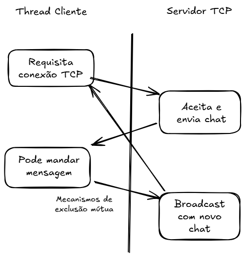

# Trabalho de Programação Concorrente - Etapa 1

## Biblioteca de Logging Thread-Safe

Implementação de uma biblioteca de logging thread-safe em C++ para a disciplina de Programação Concorrente.

## Headers principais

libtslog.h, server.h, cliente.h e chat_room.h

## Diagrama



## Como compilar e executar

```bash
# Compilar
make

# Executar
./main
