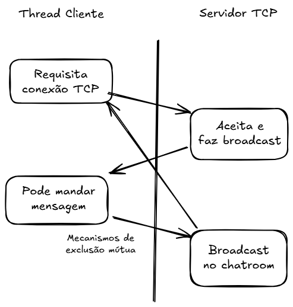

Trabalho de Programação Concorrente - Etapa 1

Biblioteca de Logging Thread-Safe
---------------------------------
Implementação de uma biblioteca de logging thread-safe em C++ para a disciplina de Programação Concorrente. Permite que múltiplas threads escrevam logs sem conflito, com timestamps e identificação de thread.

Arquivos principais
------------------
Headers:
- libtslog.h       – Biblioteca de logging thread-safe.
- server.h         – Declaração da classe SimpleTCPServer.
- client.h         – Declaração da função client_thread_job.
- chat_room.h      – (opcional, se houver funcionalidades adicionais de chat).

Implementações:
- server.cpp       – Implementa o servidor TCP:
                     - Aceita múltiplos clientes simultaneamente.
                     - Notifica a entrada e saída de clientes via logs.
                     - Retransmite mensagens recebidas para todos os clientes conectados.
                     - Mantém lista de clientes ativa de forma thread-safe.
- client.cpp       – Implementa clientes TCP simples:
                     - Conecta-se a um servidor na porta/host definidos.
                     - Envia mensagens e recebe mensagens retransmitidas pelo servidor.
                     - Pode ser executado por múltiplas threads para simular vários clientes simultâneos.

Main:
- main.cpp         – Ponto de entrada:
                     - Modo server: inicia o servidor (./app server <porta>).
                     - Modo client: cria múltiplos clientes (./app client <n_clientes> <mensagem> <host> <porta>).
                     - Se nenhum argumento for passado, executa automaticamente o script de exemplo run_example.sh,
                       que inicia servidor e clientes em background no WSL.

Diagrama da arquitetura
----------------------

Como compilar e executar
-----------------------

Compilar:
$ make

Executar manualmente:
- Iniciar servidor:
$ ./app server 8080

- Iniciar clientes:
$ ./app client 3 "Olá!" 127.0.0.1 8080

Executar script automatizado:
- No WSL, se você executar apenas:
$ ./app
O programa irá rodar automaticamente o script run_example.sh, que:
  1. Compila o programa se necessário.
  2. Inicia o servidor.
  3. Cria múltiplos clientes simulando chat.
  4. Fecha automaticamente os processos após um tempo definido.

Makefile
--------
- make run      – Compila e executa o binário manualmente.
- make clean    – Limpa arquivos compilados.
- make example  – Compila e executa o script run_example.sh.